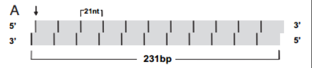

# findPhasiRNAs

## Introduction

Plant genomes encode abundant but diverse populations of small non-coding RNAs, which can be broadly divided into microRNAs (miRNAs) and endogenous small interfering RNAs (siRNAs). Endogenous siRNAs can be further grouped into several sub-classes such as heterochromatic small interfering RNAs (siRNAs), natural antisense siRNAs (nat-siRNAs) and trans-acting siRNAs (ta-siRNAs). The role of miRNAs as post-transcriptional regulators is well known. Among siRNAs, tasiRNAs and natsiRNAs are known to act as guide molecules for post-transcriptional gene regulation, and heterochromatic siRNAs in transcriptional gene silencing, but the role of phasiRNAs in gene regulation is still unclear. PhasiRNAs are produced from both protein-coding and noncoding genes. In many eudicots, three large gene families generate the majority of phasiRNAs, including those encoding nucleotide binding leucine-rich repeat proteins (NB-LRR genes), pentatricopeptide repeat proteins (PPR genes), and MYB transcription factors (MYB genes). 

This pipeline takes a statistical approach to obtain genomic loci where there is a strong signal of phasing. It computes p-values and also phasing scores. Phasing structure for each potential phasic loci is output as an image file to the output directory.   

## Formula Used

### Algorithm for computation of p-value

* Step 1: Map sRNAs to reference genome using bowtie1. Perform exact match and remember to get rid of all information about those reads which do not map to any coordinate. This needs to be done to keep the alignment file size in check

* Step 2: Add a two-nucleotide positive offset to all the sRNAs mapped on to the anti-sense strand to account for the 3’ overhang of tasiRNAs. Combine two reads which appear on both strands in the same location.

* Step 3: Now we define some terms:

L: length of the sRNA you are interested in. This value is typically between 20 and 22.

_Phase Register_: A region of the genome where an sRNA could cleave. In some papers, this same thing is called a cycle, a phase cycle or a register. Typically, a phase register is as long as ‘L’.

_Window_: A sequence of the genome which will be probed for presence of sRNAs. This has a typical length of 9L, 10L or 11L. Length of a window (mL) is often represented as a multiple of the ‘m’ – the number of phase registers it contains.

The above figure depicts a window which in this case is 231bp long. Addition of 2 nt to coordinates of the antisense strand will align the lower strand end-to-end with the strand above it. Here L=21 and m=11.

Positive Windows: Windows that abide by the 3 following rules are called positive windows:
•	Contains at least 10 unique reads
•	More than half of the reads should be ‘L’ nt long
•	At least three unique reads falling into the phase registers (Not sure how important this point is – may choose to ignore it)

Phased and non-phased locations: The vertical arrow indicates the start site for the small RNA used to determine the phased and non-phased positions. 21 phased sites relative to the start site are indicated as black vertical bars. Four hundred forty non-phased sites relative to the start site are indicated as grey. In this paper [4], they have considered the two strands separately which is why there are more phased sites. In our case there will be ‘m’ phased sites in a window.

‘n’: Total number of possible locations where phasing can occur. Hence, in our case, a window can have maximum ‘m’ such positions.

‘k’: Number of phased locations in the window which is covered by at least one sRNA.

$$pvalue = \sum_{X=k}^{m}\frac{}{}$$
